<!-- BANNER — terminal window, hand-authored SVG (dark/light), no external render dependency -->
<picture>
  <source media="(prefers-color-scheme: dark)"  srcset="assets/banner-dark.svg">
  <source media="(prefers-color-scheme: light)" srcset="assets/banner-light.svg">
  
</picture>

 

 

&nbsp;&nbsp;
&nbsp;&nbsp;

 

---

## This is me

Hi, I'm **Marcel** — AI solutions consultant at [RocaSalvatella](https://www.rocasalvatella.com), based between Sabadell and Barcelona.
I design and build agentic systems for clients, then turn what works into reusable harnesses, skills, and StartKits.

- 🏢 **AI Solutions Consultant at RocaSalvatella** — agentic solutions, harnesses, and skills for client engagements, plus personal build/research on the side.
- 🤖 Deep in **Claude Code**: skills, commands, hooks, and MCP servers as the delivery layer for client work.
- 🔗 **LangChain / LangGraph** for orchestration, **FastAPI** + **React/Next.js** for the systems around the agents, **Azure** for where it runs.
- 🎓 Mathematical Engineer — I like the work to be provably correct before it's demoed.
- 🌍 Working across Spanish, Catalan, and English.
- 💬 Talk to me about **agent harness design** or **spec-driven delivery for client AI work** and you'll have my full attention.

 

## my stack

  

<code></code>&nbsp;
<code></code>&nbsp;
<code></code>&nbsp;
<code></code>&nbsp;
<code></code>

---

Barcelona · <a href="https://marcelfedz.vercel.app/">marcelfedz.vercel.app</a>

